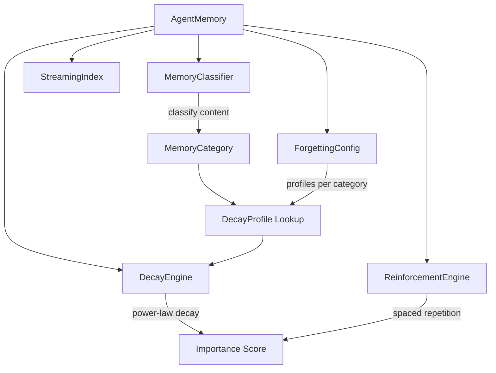
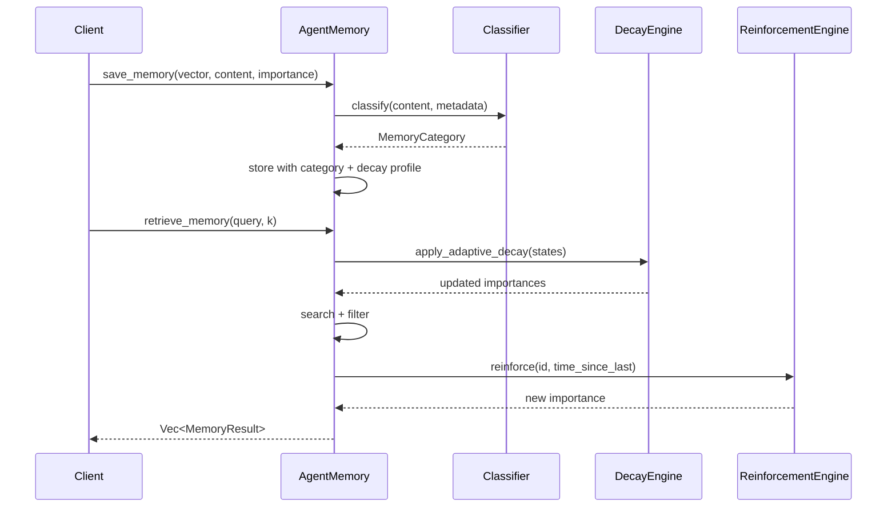

# Design Document: Adaptive Forgetting Engine

## Overview

Replace Bitcache's linear decay model (`importance -= decay_rate × days`) with a neuroscience-inspired adaptive forgetting system. Different memory categories decay along distinct curves (Ebbinghaus power-law), and reinforcement follows spaced repetition principles where accessing a memory after a long gap strengthens it more than frequent short-interval access.

## Architecture



The engine integrates into the existing `AgentMemory` struct as an optional layer. When `ForgettingConfig` is present, `apply_adaptive_decay` replaces the linear `apply_decay`, and `reinforce_spaced` replaces the flat `reinforce`. The classifier runs at insert time to tag each memory with a `MemoryCategory`.

## Components and Interfaces

### Component 1: MemoryClassifier

**Purpose**: Auto-classify memory content into one of 5 categories using regex pattern matching. No LLM calls.

**Interface**:
```rust
pub struct MemoryClassifier {
    personal_patterns: Vec<Regex>,
    emotional_patterns: Vec<Regex>,
    preference_patterns: Vec<Regex>,
    trivial_patterns: Vec<Regex>,
    factual_patterns: Vec<Regex>,
}

impl MemoryClassifier {
    pub fn new() -> Self;
    pub fn classify(&self, content: &str, metadata: &HashMap<String, String>) -> MemoryCategory;
}
```

**Responsibilities**:
- Pattern-match content against category-specific keyword sets
- Respect explicit metadata overrides (`memory_category` key)
- Default to `Factual` when no patterns match
- Compile regex patterns once at construction (not per-call)

### Component 2: DecayEngine (integrated into AgentMemory)

**Purpose**: Apply Ebbinghaus power-law forgetting curves with category-specific parameters.

**Interface**:
```rust
// Pure function — no state mutation
fn compute_retention(elapsed_hours: f64, stability: f64, exponent: f64) -> f64;

// Mutates all memory states in-place
impl AgentMemory {
    fn apply_adaptive_decay(&mut self);
}
```

**Responsibilities**:
- Compute retention using `R(t) = 1 / (1 + (t/S)^e)`
- Factor in per-memory `stability_multiplier` from spaced repetition
- Enforce per-category importance floor
- Run once per `retrieve_memory` call

### Component 3: ReinforcementEngine (integrated into AgentMemory)

**Purpose**: Strengthen memories on access using spaced repetition principles.

**Interface**:
```rust
impl AgentMemory {
    fn reinforce_spaced(&mut self, id: &str) -> bool;
}
```

**Responsibilities**:
- Compute gap bonus using logarithmic scaling
- Boost both current importance and base importance (consolidation)
- Increase stability multiplier (memory becomes harder to forget)
- Maintain bounded access history

## Data Models

### Model 1: AdaptiveMemoryState

```rust
#[derive(Clone, Debug)]
struct AdaptiveMemoryState {
    pub importance: f64,
    pub base_importance: f64,
    pub category: MemoryCategory,
    pub access_count: u64,
    pub last_accessed: f64,
    pub created_at: f64,
    pub repetition: RepetitionState,
}
```

**Validation Rules**:
- `importance` in `[0.0, 1.0]`
- `base_importance` in `[0.0, 1.0]`
- `base_importance >= importance` (after decay, before reinforcement)
- `last_accessed >= created_at`
- `access_count` monotonically increases

### Model 2: DecayProfile

```rust
#[derive(Clone, Debug, Serialize, Deserialize)]
pub struct DecayProfile {
    pub stability: f64,
    pub floor: f64,
    pub exponent: f64,
}
```

**Validation Rules**:
- `stability > 0.0` (hours until 50% retention)
- `floor >= 0.0 && floor < 1.0`
- `exponent > 0.0 && exponent <= 1.0`

### Model 3: RepetitionState

```rust
#[derive(Clone, Debug)]
struct RepetitionState {
    pub rep_count: u64,
    pub stability_multiplier: f64,
    pub access_history: Vec<f64>,
}
```

**Validation Rules**:
- `stability_multiplier >= 1.0` (starts at 1.0, only grows)
- `access_history.len() <= config.max_history_len`
- All timestamps in `access_history` are monotonically increasing

## Main Algorithm/Workflow



## Core Interfaces/Types

```rust
/// Memory categories inspired by cognitive science memory systems.
#[derive(Clone, Copy, Debug, PartialEq, Eq, Hash, Serialize, Deserialize)]
pub enum MemoryCategory {
    /// Personal identity, relationships, life events — decays very slowly
    Personal,
    /// Emotional content, strong reactions — decays slowly
    Emotional,
    /// Facts, technical knowledge, infrastructure — medium decay
    Factual,
    /// User preferences, habits — slow-medium decay
    Preference,
    /// Trivial observations, small talk, transient info — decays fast
    Trivial,
}

/// Decay profile controlling the forgetting curve for a category.
#[derive(Clone, Debug, Serialize, Deserialize)]
pub struct DecayProfile {
    /// Stability factor S: higher = slower decay (hours until 50% retention)
    pub stability: f64,
    /// Minimum importance floor — memory never decays below this
    pub floor: f64,
    /// Power-law exponent (Ebbinghaus uses ~0.5-0.8, higher = faster drop)
    pub exponent: f64,
}

/// Spaced repetition state tracked per memory.
#[derive(Clone, Debug)]
struct RepetitionState {
    /// Number of successful retrievals
    pub rep_count: u64,
    /// Current stability multiplier (grows with spaced repetitions)
    pub stability_multiplier: f64,
    /// Timestamps of last N accesses for gap calculation
    pub access_history: Vec<f64>,
}

/// Extended memory state replacing the current flat MemoryState.
#[derive(Clone, Debug)]
struct AdaptiveMemoryState {
    pub importance: f64,
    pub base_importance: f64,
    pub category: MemoryCategory,
    pub access_count: u64,
    pub last_accessed: f64,
    pub created_at: f64,
    pub repetition: RepetitionState,
}


/// Configuration for the adaptive forgetting engine.
#[derive(Clone, Debug, Serialize, Deserialize)]
pub struct ForgettingConfig {
    pub profiles: HashMap<MemoryCategory, DecayProfile>,
    /// Max access history entries to retain per memory
    pub max_history_len: usize,
    /// Spaced repetition bonus cap
    pub max_stability_multiplier: f64,
}
```

## Key Functions with Formal Specifications

### Function 1: `classify_memory`

```rust
impl MemoryClassifier {
    /// Classify memory content into a category using keyword heuristics.
    /// No LLM calls — runs in microseconds.
    pub fn classify(
        &self,
        content: &str,
        metadata: &HashMap<String, String>,
    ) -> MemoryCategory
}
```

**Preconditions:**
- `content` is a non-empty UTF-8 string
- `metadata` is a valid (possibly empty) map

**Postconditions:**
- Returns exactly one `MemoryCategory` variant
- Classification is deterministic: same input always yields same output
- Runs in O(n × p) where n = content length, p = number of patterns
- No heap allocation beyond the return value

**Loop Invariants:** N/A (single-pass pattern scan)

---

### Function 2: `compute_retention`

```rust
/// Compute current retention factor using Ebbinghaus power-law forgetting curve.
///
/// R(t) = 1 / (1 + (t / S)^e)
///
/// Where:
///   t = time elapsed since last access (in hours)
///   S = stability (hours until ~50% retention)
///   e = power-law exponent
fn compute_retention(
    elapsed_hours: f64,
    stability: f64,
    exponent: f64,
) -> f64
```

**Preconditions:**
- `elapsed_hours >= 0.0`
- `stability > 0.0`
- `exponent > 0.0`

**Postconditions:**
- Returns value in range `(0.0, 1.0]`
- When `elapsed_hours == 0.0`, returns `1.0`
- Monotonically decreasing as `elapsed_hours` increases
- When `elapsed_hours == stability`, returns approximately `1 / (1 + 1^e)` = `0.5`

**Loop Invariants:** N/A (pure computation)

---

### Function 3: `apply_adaptive_decay`

```rust
impl AgentMemory {
    /// Apply category-specific power-law decay to all memories.
    fn apply_adaptive_decay(&mut self) {
        let ts = now();
        for state in self.states.values_mut() {
            let profile = self.config.profiles
                .get(&state.category)
                .unwrap_or(&DEFAULT_PROFILE);

            let elapsed_hours = (ts - state.last_accessed) / 3600.0;
            let effective_stability = profile.stability
                * state.repetition.stability_multiplier;

            let retention = compute_retention(
                elapsed_hours,
                effective_stability,
                profile.exponent,
            );

            // importance = base_importance × retention, floored
            state.importance = (state.base_importance * retention)
                .max(profile.floor);
        }
    }
}
```

**Preconditions:**
- All `MemoryState` entries have valid `category` fields
- `self.config.profiles` contains entries for all categories (or DEFAULT_PROFILE is used)
- System clock returns a value >= all `last_accessed` timestamps

**Postconditions:**
- For every state: `profile.floor <= state.importance <= state.base_importance`
- States with `elapsed_hours == 0` retain full `base_importance`
- No state is removed (decay only adjusts importance, eviction is separate)
- States with higher `stability_multiplier` decay slower

**Loop Invariants:**
- Each iteration processes exactly one memory state
- No state is visited more than once

---

### Function 4: `reinforce_spaced`

```rust
impl AgentMemory {
    /// Reinforce a memory following spaced repetition principles.
    /// Longer gaps since last access yield stronger reinforcement.
    fn reinforce_spaced(&mut self, id: &str) -> bool {
        let state = match self.states.get_mut(id) {
            Some(s) => s,
            None => return false,
        };

        let ts = now();
        let gap_hours = (ts - state.last_accessed) / 3600.0;

        // Spaced repetition bonus: log-scaled gap reward
        // Accessing after 24h is worth more than accessing after 1h
        let gap_bonus = (1.0 + gap_hours).ln() / (1.0 + 24.0_f64).ln();
        let clamped_bonus = gap_bonus.clamp(0.1, 2.0);

        // Base reinforcement amount scaled by gap bonus
        let reinforce = self.reinforce_amount * clamped_bonus;

        // Update importance (capped at 1.0)
        state.importance = (state.importance + reinforce).min(1.0);
        // Also raise the base (memory consolidation)
        state.base_importance = (state.base_importance + reinforce * 0.5)
            .min(1.0);

        // Update stability multiplier (spaced repetition strengthens retention)
        state.repetition.rep_count += 1;
        state.repetition.stability_multiplier =
            (state.repetition.stability_multiplier + clamped_bonus * 0.2)
                .min(self.config.max_stability_multiplier);

        // Track access history
        state.repetition.access_history.push(ts);
        if state.repetition.access_history.len() > self.config.max_history_len {
            state.repetition.access_history.remove(0);
        }

        state.access_count += 1;
        state.last_accessed = ts;
        true
    }
}
```

**Preconditions:**
- `id` is a valid string (may or may not exist in states)
- System clock >= `state.last_accessed`

**Postconditions:**
- If `id` not found: returns `false`, no state modified
- If found: `state.importance >= old_importance` (reinforcement never decreases)
- `state.importance <= 1.0`
- `state.base_importance <= 1.0`
- `state.repetition.stability_multiplier <= config.max_stability_multiplier`
- `state.access_count == old_access_count + 1`
- `state.last_accessed == ts`
- `state.repetition.access_history.len() <= config.max_history_len`

**Loop Invariants:** N/A (single-entry operation)

---

### Function 5: `default_profiles`

```rust
/// Default decay profiles inspired by cognitive science research.
pub fn default_profiles() -> HashMap<MemoryCategory, DecayProfile> {
    let mut profiles = HashMap::new();

    profiles.insert(MemoryCategory::Personal, DecayProfile {
        stability: 8760.0,   // ~1 year in hours
        floor: 0.3,          // personal memories never fully fade
        exponent: 0.3,       // very gentle curve
    });

    profiles.insert(MemoryCategory::Emotional, DecayProfile {
        stability: 4380.0,   // ~6 months
        floor: 0.2,          // emotional residue persists
        exponent: 0.4,
    });

    profiles.insert(MemoryCategory::Factual, DecayProfile {
        stability: 720.0,    // ~30 days
        floor: 0.05,
        exponent: 0.5,       // classic Ebbinghaus
    });

    profiles.insert(MemoryCategory::Preference, DecayProfile {
        stability: 2160.0,   // ~90 days
        floor: 0.15,         // preferences are sticky
        exponent: 0.4,
    });

    profiles.insert(MemoryCategory::Trivial, DecayProfile {
        stability: 48.0,     // 2 days
        floor: 0.0,          // can fully vanish
        exponent: 0.8,       // steep drop-off
    });

    profiles
}
```

**Preconditions:** None (pure constructor)

**Postconditions:**
- Returns map with exactly 5 entries (one per `MemoryCategory` variant)
- All `stability > 0.0`
- All `floor >= 0.0 && floor < 1.0`
- All `exponent > 0.0 && exponent <= 1.0`
- `Personal.stability > Emotional.stability > Preference.stability > Factual.stability > Trivial.stability`

## Algorithmic Pseudocode

### Memory Classification Algorithm

```rust
/// Pattern-based classifier. Matches content against weighted keyword sets.
/// Falls back to metadata hints, then defaults to Factual.
pub fn classify(content: &str, metadata: &HashMap<String, String>) -> MemoryCategory {
    let lower = content.to_lowercase();

    // Priority 1: Explicit metadata override
    if let Some(cat) = metadata.get("memory_category") {
        if let Ok(c) = cat.parse::<MemoryCategory>() {
            return c;
        }
    }

    // Priority 2: Pattern matching with scores
    let mut scores: HashMap<MemoryCategory, f64> = HashMap::new();

    // Personal signals
    let personal_patterns = [
        r"\bmy name\b", r"\bi am\b", r"\bi work\b",
        r"\bmy (wife|husband|daughter|son|family)\b",
        r"\bborn\b", r"\bgrew up\b", r"\bmy home\b",
    ];
    for pat in &personal_patterns {
        if regex_match(pat, &lower) {
            *scores.entry(MemoryCategory::Personal).or_default() += 1.0;
        }
    }

    // Emotional signals
    let emotional_patterns = [
        r"\b(love|hate|afraid|angry|happy|sad|excited|anxious)\b",
        r"\b(amazing|terrible|worst|best day)\b",
        r"!{2,}",  // multiple exclamation marks
        r"\b(miss|grief|joy|proud)\b",
    ];
    for pat in &emotional_patterns {
        if regex_match(pat, &lower) {
            *scores.entry(MemoryCategory::Emotional).or_default() += 1.0;
        }
    }

    // Preference signals
    let preference_patterns = [
        r"\bi (prefer|always|never|like|dislike)\b",
        r"\b(favorite|favourite)\b",
        r"\bplease (always|never|remember)\b",
        r"\bdon't (like|want|use)\b",
    ];
    for pat in &preference_patterns {
        if regex_match(pat, &lower) {
            *scores.entry(MemoryCategory::Preference).or_default() += 1.0;
        }
    }

    // Trivial signals
    let trivial_patterns = [
        r"\b(lunch|weather|coffee|snack|printer|wifi)\b",
        r"\b(boring|nothing special|decent)\b",
        r"\bgrabbed\b", r"\bjust (now|finished)\b",
    ];
    for pat in &trivial_patterns {
        if regex_match(pat, &lower) {
            *scores.entry(MemoryCategory::Trivial).or_default() += 1.0;
        }
    }

    // Factual signals (technical, infrastructure)
    let factual_patterns = [
        r"\b(version|v\d|api|database|server|deploy)\b",
        r"\b(sla|uptime|production|config)\b",
        r"\d+\.\d+",  // version numbers
        r"\b(migrated|upgraded|installed)\b",
    ];
    for pat in &factual_patterns {
        if regex_match(pat, &lower) {
            *scores.entry(MemoryCategory::Factual).or_default() += 1.0;
        }
    }

    // Return highest-scoring category, default to Factual
    scores.into_iter()
        .max_by(|a, b| a.1.partial_cmp(&b.1).unwrap())
        .map(|(cat, _)| cat)
        .unwrap_or(MemoryCategory::Factual)
}
```

### Adaptive Decay Algorithm (Full Flow)

```rust
/// Complete decay pass over all memories.
/// Called once per retrieve_memory() invocation.
fn apply_adaptive_decay(&mut self) {
    let ts = now();

    for state in self.states.values_mut() {
        let profile = self.config.profiles
            .get(&state.category)
            .unwrap_or(&DEFAULT_PROFILE);

        // Effective stability accounts for spaced repetition strengthening
        let effective_stability = profile.stability
            * state.repetition.stability_multiplier;

        // Time since last access in hours
        let elapsed_hours = (ts - state.last_accessed) / 3600.0;
        if elapsed_hours <= 0.0 {
            continue; // just accessed, no decay
        }

        // Ebbinghaus power-law retention curve
        // R(t) = 1 / (1 + (t/S)^e)
        let ratio = elapsed_hours / effective_stability;
        let retention = 1.0 / (1.0 + ratio.powf(profile.exponent));

        // Apply retention to base importance, enforce floor
        state.importance = (state.base_importance * retention)
            .max(profile.floor)
            .min(1.0);
    }
}
```

### Spaced Repetition Reinforcement Algorithm

```rust
/// Reinforcement that rewards longer gaps between accesses.
///
/// Core insight: accessing a memory after 7 days strengthens it more
/// than accessing it 7 times in 1 day. This mirrors how human memory
/// consolidation works during sleep/rest periods.
fn reinforce_spaced(&mut self, id: &str) -> bool {
    let state = match self.states.get_mut(id) {
        Some(s) => s,
        None => return false,
    };

    let ts = now();
    let gap_hours = (ts - state.last_accessed) / 3600.0;

    // Gap bonus: logarithmic scaling normalized to 24h baseline
    // gap=0h → bonus≈0.1 (minimum), gap=24h → bonus≈1.0, gap=168h(7d) → bonus≈1.6
    let gap_bonus = (1.0 + gap_hours).ln() / (1.0 + 24.0_f64).ln();
    let clamped_bonus = gap_bonus.clamp(0.1, 2.0);

    // Reinforcement = base_amount × gap_bonus
    let reinforce = self.reinforce_amount * clamped_bonus;

    // Boost current importance
    state.importance = (state.importance + reinforce).min(1.0);

    // Consolidation: partially raise the base importance
    // (simulates memory moving from short-term to long-term)
    state.base_importance = (state.base_importance + reinforce * 0.5).min(1.0);

    // Strengthen stability (memory becomes harder to forget)
    state.repetition.rep_count += 1;
    state.repetition.stability_multiplier =
        (state.repetition.stability_multiplier + clamped_bonus * 0.2)
            .min(self.config.max_stability_multiplier);

    // Record access timestamp
    state.repetition.access_history.push(ts);
    if state.repetition.access_history.len() > self.config.max_history_len {
        state.repetition.access_history.remove(0);
    }

    state.access_count += 1;
    state.last_accessed = ts;
    true
}
```

## Example Usage

```rust
use bitcache::{AgentMemory, MemoryCategory, DecayProfile, ForgettingConfig};
use std::collections::HashMap;

fn main() {
    // Create memory with adaptive forgetting
    let config = ForgettingConfig::default(); // uses default_profiles()
    let mut mem = AgentMemory::new(
        384,        // dimension
        1000,       // capacity
        0.05,       // base decay_rate (unused with adaptive, kept for compat)
        0.1,        // base reinforce_amount
        10,         // rerank_factor
    ).with_forgetting_config(config);

    // Store a personal memory — will auto-classify as Personal
    let v = embed("My name is Arjun and I work as a DevOps engineer");
    let id = mem.save_memory(
        &v,
        "My name is Arjun and I work as a DevOps engineer",
        0.8,
        None,
        None,
    );
    // Internally: classified as Personal, stability=8760h, floor=0.3

    // Store a trivial memory — will auto-classify as Trivial
    let v2 = embed("Had pizza for lunch, it was decent");
    mem.save_memory(&v2, "Had pizza for lunch, it was decent", 0.5, None, None);
    // Internally: classified as Trivial, stability=48h, floor=0.0

    // After 3 days: personal memory barely decayed, trivial memory nearly gone
    // Personal: R(72h) = 1/(1 + (72/8760)^0.3) ≈ 0.97 → importance ≈ 0.78
    // Trivial:  R(72h) = 1/(1 + (72/48)^0.8)   ≈ 0.43 → importance ≈ 0.22

    // Retrieve after a week — spaced repetition kicks in
    let query = embed("What's my name?");
    let results = mem.retrieve_memory(&query, 5, 0.1);
    // The personal memory gets a strong reinforcement (gap_bonus ≈ 1.6)
    // Its stability_multiplier increases, making future decay even slower

    // Override category via metadata
    let mut meta = HashMap::new();
    meta.insert("memory_category".to_string(), "emotional".to_string());
    let v3 = embed("The deployment went perfectly");
    mem.save_memory(&v3, "The deployment went perfectly", 0.7, None, Some(meta));
    // Forced to Emotional category regardless of classifier output

    // Custom decay profile
    let mut custom_config = ForgettingConfig::default();
    custom_config.profiles.insert(MemoryCategory::Factual, DecayProfile {
        stability: 1440.0,  // 60 days instead of default 30
        floor: 0.1,
        exponent: 0.45,
    });
    let mem2 = AgentMemory::new(384, 1000, 0.05, 0.1, 10)
        .with_forgetting_config(custom_config);
}
```

## Correctness Properties

### Property 1: Retention is bounded in (0, 1]

For all `elapsed_hours >= 0`, `stability > 0`, `exponent > 0`:
`0 < compute_retention(elapsed_hours, stability, exponent) <= 1.0`

```rust
proptest! {
    #[test]
    fn retention_bounded(
        elapsed in 0.0f64..1_000_000.0,
        stability in 0.001f64..100_000.0,
        exponent in 0.01f64..2.0,
    ) {
        let r = compute_retention(elapsed, stability, exponent);
        prop_assert!(r > 0.0 && r <= 1.0);
    }
}
```

### Property 2: Retention is monotonically decreasing with time

For all `t1 < t2`, `compute_retention(t1, s, e) >= compute_retention(t2, s, e)`

```rust
proptest! {
    #[test]
    fn retention_monotone_decreasing(
        t1 in 0.0f64..10000.0,
        delta in 0.001f64..10000.0,
        stability in 1.0f64..10000.0,
        exponent in 0.1f64..1.0,
    ) {
        let t2 = t1 + delta;
        let r1 = compute_retention(t1, stability, exponent);
        let r2 = compute_retention(t2, stability, exponent);
        prop_assert!(r1 >= r2);
    }
}
```

### Property 3: Higher stability yields slower decay

For all `s2 > s1` and fixed `elapsed, exponent`: `retention(s2) >= retention(s1)`

```rust
proptest! {
    #[test]
    fn higher_stability_slower_decay(
        elapsed in 1.0f64..10000.0,
        s1 in 1.0f64..5000.0,
        delta in 0.1f64..5000.0,
        exponent in 0.1f64..1.0,
    ) {
        let s2 = s1 + delta;
        let r1 = compute_retention(elapsed, s1, exponent);
        let r2 = compute_retention(elapsed, s2, exponent);
        prop_assert!(r2 >= r1);
    }
}
```

### Property 4: Importance never exceeds 1.0 after reinforcement

For all valid inputs, `reinforce_spaced` caps importance at 1.0.

```rust
proptest! {
    #[test]
    fn importance_capped_at_one(
        base_importance in 0.0f64..1.0,
        reinforce_amount in 0.0f64..1.0,
        gap_hours in 0.0f64..10000.0,
    ) {
        let gap_bonus = (1.0 + gap_hours).ln() / (1.0 + 24.0_f64).ln();
        let clamped = gap_bonus.clamp(0.1, 2.0);
        let new_importance = (base_importance + reinforce_amount * clamped).min(1.0);
        prop_assert!(new_importance <= 1.0);
    }
}
```

### Property 5: Importance never drops below floor after decay

For all memories with category profile floor `f`: `importance >= f` after decay.

```rust
proptest! {
    #[test]
    fn importance_respects_floor(
        base in 0.0f64..1.0,
        elapsed in 0.0f64..100000.0,
        stability in 1.0f64..10000.0,
        exponent in 0.1f64..1.0,
        floor in 0.0f64..0.5,
    ) {
        let retention = compute_retention(elapsed, stability, exponent);
        let importance = (base * retention).max(floor);
        prop_assert!(importance >= floor);
    }
}
```

### Property 6: Longer gap yields stronger reinforcement (spaced repetition)

For all `gap2 > gap1`: `gap_bonus(gap2) >= gap_bonus(gap1)`

```rust
proptest! {
    #[test]
    fn longer_gap_stronger_reinforcement(
        gap1 in 0.0f64..1000.0,
        delta in 0.1f64..1000.0,
    ) {
        let gap2 = gap1 + delta;
        let bonus1 = ((1.0 + gap1).ln() / (1.0 + 24.0_f64).ln()).clamp(0.1, 2.0);
        let bonus2 = ((1.0 + gap2).ln() / (1.0 + 24.0_f64).ln()).clamp(0.1, 2.0);
        prop_assert!(bonus2 >= bonus1);
    }
}
```

### Property 7: Classification is deterministic

For all content strings, `classify(content, meta)` returns the same result on repeated calls.

```rust
proptest! {
    #[test]
    fn classification_deterministic(content in "\\PC{1,200}") {
        let meta = HashMap::new();
        let c1 = classify(&content, &meta);
        let c2 = classify(&content, &meta);
        prop_assert_eq!(c1, c2);
    }
}
```

### Property 8: Personal memories outlive trivial memories at any time horizon

With default profiles, for all `t > 0`: `retention_personal(t) > retention_trivial(t)`

```rust
proptest! {
    #[test]
    fn personal_outlives_trivial(elapsed in 1.0f64..100000.0) {
        let profiles = default_profiles();
        let personal = &profiles[&MemoryCategory::Personal];
        let trivial = &profiles[&MemoryCategory::Trivial];
        let r_personal = compute_retention(elapsed, personal.stability, personal.exponent);
        let r_trivial = compute_retention(elapsed, trivial.stability, trivial.exponent);
        prop_assert!(r_personal > r_trivial);
    }
}
```

## Error Handling

### Error Scenario 1: Unknown category in metadata

**Condition**: `metadata["memory_category"]` contains an unrecognized string
**Response**: Ignore the metadata hint, fall through to pattern-based classification
**Recovery**: Automatic — no error propagated to caller

### Error Scenario 2: Clock skew (last_accessed > now)

**Condition**: System clock moves backward, causing negative elapsed time
**Response**: Skip decay for that memory (treat elapsed as 0)
**Recovery**: Memory retains current importance until clock catches up

### Error Scenario 3: All patterns fail to match

**Condition**: Content doesn't match any category's keyword patterns
**Response**: Default to `MemoryCategory::Factual` (medium decay, safe default)
**Recovery**: User can override via metadata on next store

### Error Scenario 4: NaN/Inf in computation

**Condition**: Extreme float values in `powf` or `ln` operations
**Response**: Clamp inputs before computation (`elapsed_hours.max(0.0)`, `stability.max(0.001)`)
**Recovery**: Returns conservative retention value of 1.0 (no decay) rather than corrupting state

## Testing Strategy

### Unit Testing Approach

- Test `compute_retention` with known values (e.g., `elapsed=stability` should yield ~0.5)
- Test `classify` with representative strings for each category
- Test `reinforce_spaced` with various gap durations
- Test `default_profiles` returns valid, ordered profiles
- Test backward compatibility: `AgentMemory::new` without `with_forgetting_config` uses legacy linear decay

### Property-Based Testing Approach

**Property Test Library**: `proptest` (Rust)

All 8 correctness properties above are implemented as proptest tests. Key properties:
- Boundedness (retention in (0,1], importance in [floor, 1.0])
- Monotonicity (retention decreases with time, reinforcement increases with gap)
- Ordering (personal > trivial retention for all time horizons)
- Determinism (classification is pure)

### Integration Testing Approach

- End-to-end test: store memories of different categories, advance simulated time, verify correct relative ordering after decay
- Benchmark: compare adaptive decay performance vs linear decay (should be negligible overhead since `powf` is the only added cost per memory)
- Python binding test: verify `ForgettingConfig` is accessible from PyO3 interface
