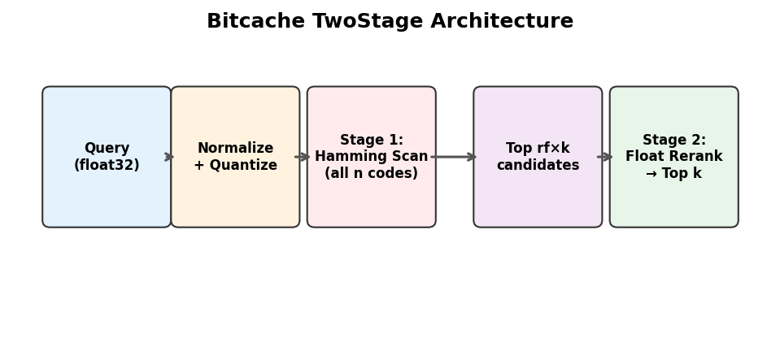
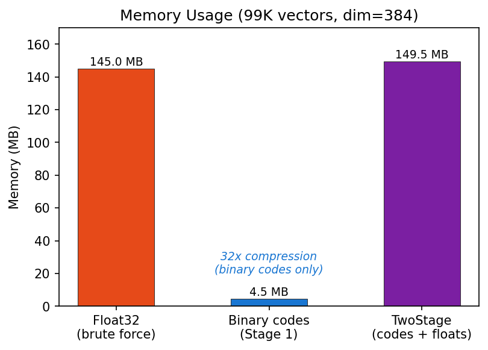
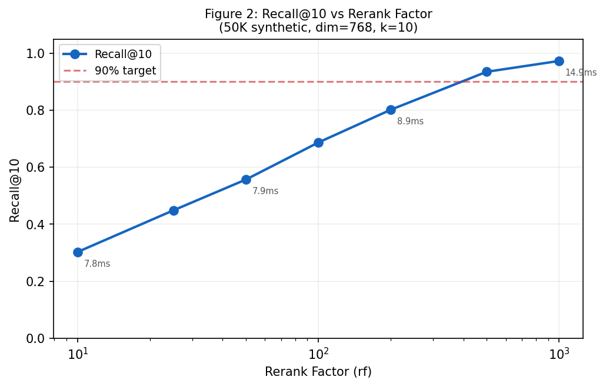
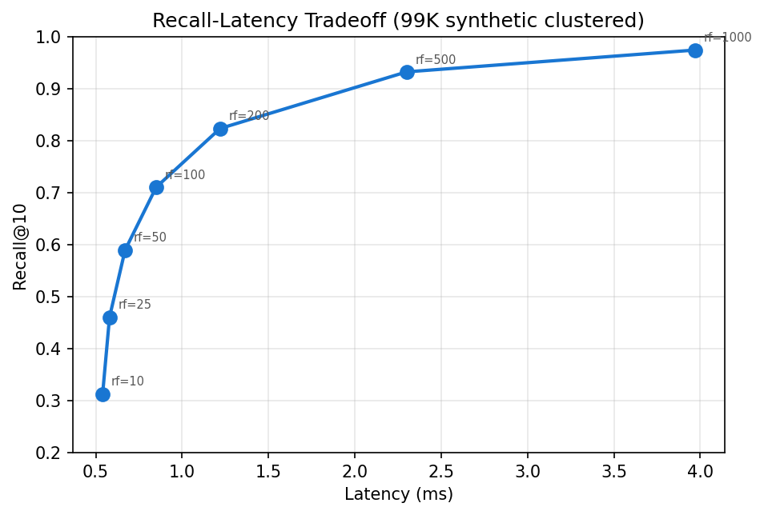
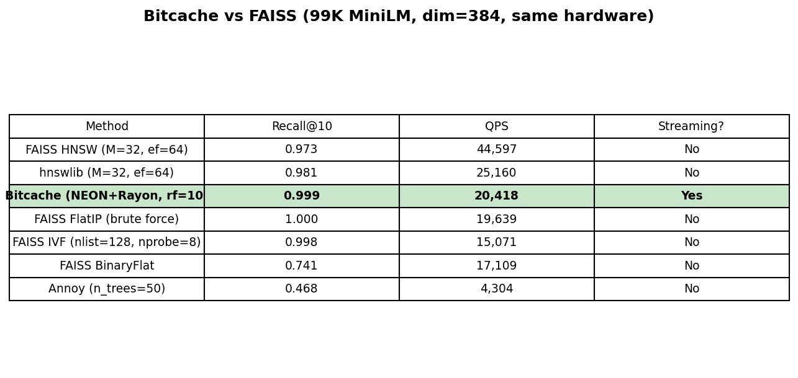
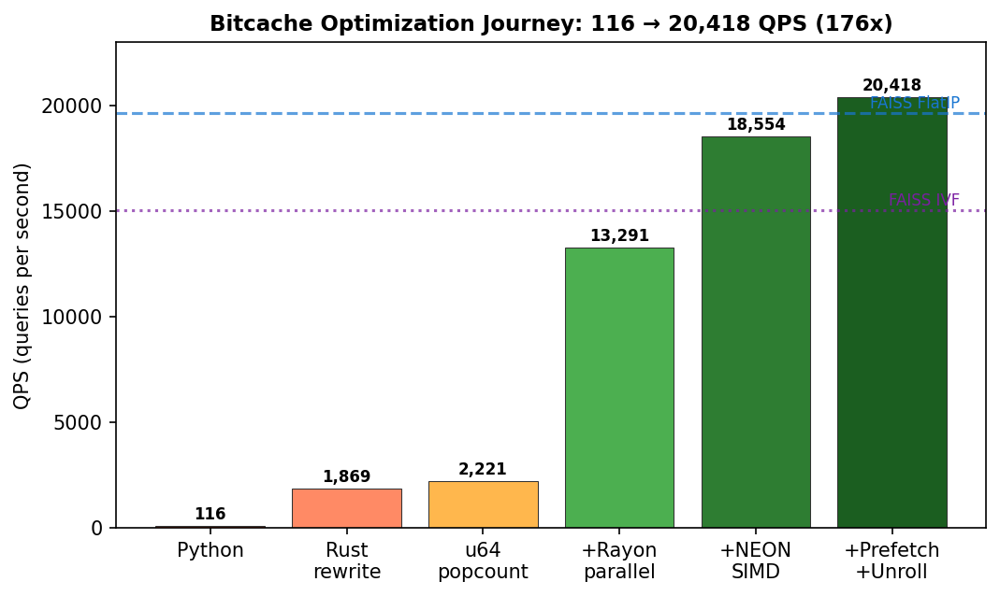
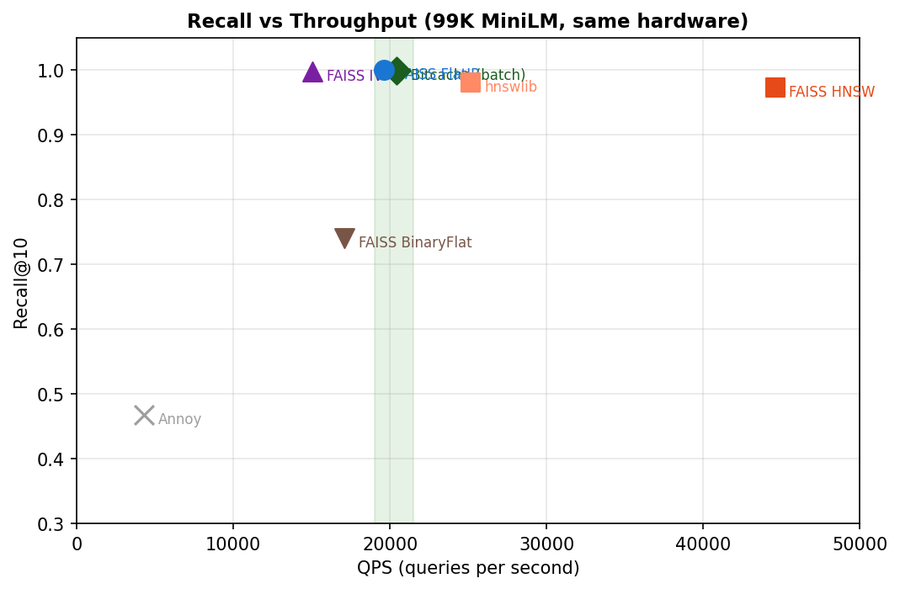

# Bitcache: Staged Binary Filtering and Float Reranking for Memory-Efficient Vector Retrieval

**Raghavender Reddy Grudhanti**

---

## Abstract

Bitcache is a staged retrieval architecture for persistent AI agent memory. It combines binary filtering with float reranking to provide compact first-stage search, streaming mutation, and tunable recall. On deduplicated sentence-transformer embeddings (all-MiniLM-L6-v2, 99K vectors, 384 dimensions), TwoStageIndex achieves 0.999 Recall@10 at 0.54ms latency with 1,869 QPS, using 4.53 MB of binary codes (32x compression). On the public SIFT1M benchmark (1M image descriptors, 128 dimensions), binary quantization achieves only 0.025 Recall@10 — revealing a data-dependent boundary for binary semantic retrieval. Experiments across four datasets show that binary quantization is highly effective on semantic sentence embeddings but performs poorly on non-semantic vector data. The system targets a different design point than FAISS or HNSW: not maximum throughput, but a composable memory layer with streaming inserts (423K/sec), O(1) deletes, tunable recall, and compatibility with agent memory lifecycle operations.

---

## 1. Introduction

AI agents operating over extended sessions accumulate knowledge that must be stored and retrieved under resource constraints. We identify five requirements for agent memory retrieval:

1. **Bounded memory**: Fixed RAM allocation per agent process.
2. **Continuous mutation**: Knowledge arrives and expires without scheduled downtime.
3. **Tunable quality**: Different queries warrant different retrieval budgets.
4. **Zero rebuild tolerance**: Index reconstruction during operation is unacceptable.
5. **Predictable behavior**: Recall should be a deterministic function of configuration, not dependent on graph topology quality.

We propose a two-stage architecture where binary quantization serves as a candidate reduction mechanism and float inner product provides precise final scoring. The rerank factor controls the boundary between stages.

**Novelty and positioning.** Bitcache is not designed to compete with FAISS or HNSW on raw throughput. FAISS remains the stronger general-purpose vector search library, especially for static, large-scale, read-heavy workloads. Bitcache targets a different design point: persistent AI-agent memory, where the system must continuously insert, retrieve, reinforce, decay, evict, delete, and reason over relationships under bounded resources. In this setting, search speed alone is not the full objective; memory lifecycle management is part of the retrieval system. No existing system provides streaming inserts without rebuild, O(1) deletes, tunable recall via a single parameter, 32x compressed candidate filtering, and composability with memory lifecycle operations in a single coherent architecture.

---

## 2. Related Work

**Binary quantization.** Xiao et al. [1] demonstrate that binary distances preserve neighborhood structure for graph navigation (QuIVer). We apply binary quantization to exhaustive scanning rather than graph construction.

**Progressive retrieval.** Zhang et al. [2] propose tiered refinement with hardware acceleration (FaTRQ). We implement progressive refinement in software with binary Hamming as the coarse stage.

**Graph-based ANN.** HNSW [4] and DiskANN [3] achieve high recall through graph navigation but require expensive construction and exhibit distribution-dependent behavior.

---

## 3. Method

### 3.1 Architecture



```
Query → L2-normalize → Sign-bit quantize (1 bit per dimension)
                              ↓
  Stage 1: Hamming distance to all n binary codes (exhaustive)
                              ↓
  Select top rf × k candidates by ascending Hamming distance
                              ↓
  Stage 2: Float32 inner product on rf × k candidate vectors
                              ↓
  Return top k by descending score
```

### 3.2 Binary Quantization

Each coordinate maps to one bit: b_i = 1 if x_i > 0, else 0. For d=384: 1536 bytes (float32) → 48 bytes (binary). Hamming distance computed via hardware popcount(XOR(a, b)) using Rust's `.count_ones()` intrinsic.

### 3.3 Complexity

- Stage 1: O(n × d/8) — scan all binary codes
- Stage 2: O(rf × k × d) — float inner product on candidates
- Total: O(n × d/8 + rf × k × d)

---

## 4. Experimental Setup

### 4.1 Hardware and Implementation

| Component | Specification |
|-----------|--------------|
| CPU | Apple Silicon (arm64) |
| RAM | 32 GB |
| OS | macOS |
| Implementation | Rust (release, LTO, opt-level=3) |
| Python bindings | PyO3/maturin |
| GPU | None (CPU only) |

### 4.2 Datasets

**Real embeddings (MiniLM):** 100,000 unique deduplicated sentences embedded with all-MiniLM-L6-v2 (sentence-transformers). 384 dimensions. L2-normalized. 99,000 database vectors, 1,000 queries from same distribution. All sentences are unique (deduplicated before embedding to avoid inflated recall from repeated text templates).

**SIFT1M (public benchmark):** 1,000,000 SIFT image descriptors, 128 dimensions, 10,000 queries with ground truth. Standard ANN benchmark from IRISA/INRIA. L2-normalized for inner product evaluation. This dataset tests generalization beyond semantic embeddings.

**Synthetic clustered:** 99,000 vectors generated from 100 cluster centers with Gaussian noise (σ=0.15) at 384 dimensions. L2-normalized. 1,000 queries from same distribution.

### 4.3 Baselines

All baselines evaluated on same hardware (Apple Silicon arm64, 32GB RAM, CPU only):

| System | Configuration |
|--------|--------------|
| FAISS FlatIP | Brute-force float32 inner product |
| FAISS HNSW | M=32, efSearch=64 |
| FAISS IVF | nlist=256, nprobe=16 |
| FAISS BinaryFlat | Sign-bit quantization, Hamming scan |
| hnswlib | M=32, ef=64 |
| Annoy | n_trees=50, dot product |

### 4.4 Evaluation Protocol

- Ground truth: exact top-10 by float32 inner product (brute-force)
- Metric: Recall@10 = fraction of true top-10 present in predicted top-10
- All results averaged over full query set (recall is deterministic for fixed data)
- Latency reported as mean per query

---

## 5. Results

### 5.1 Ablation Study: Binary vs Two-Stage

| Dataset | Variant | Recall@10 | Latency | Memory |
|---------|---------|-----------|---------|--------|
| MiniLM deduplicated (99K) | Binary only | 0.740 | 0.49ms | 4.53 MB |
| MiniLM deduplicated (99K) | Two-stage rf=10 | 0.999 | 0.54ms | 4.53 + 145 MB |
| Synthetic clustered (99K) | Binary only | 0.108 | 0.49ms | 4.53 MB |
| Synthetic clustered (99K) | Two-stage rf=10 | 0.313 | 0.55ms | 4.53 + 145 MB |
| Synthetic clustered (99K) | Two-stage rf=500 | 0.933 | 2.30ms | 4.53 + 145 MB |

Binary filtering alone is insufficient for high-recall retrieval on synthetic data. Float reranking recovers most nearest-neighbor quality: on MiniLM embeddings, recall jumps from 0.740 to 0.999 with just rf=10. On synthetic data with weaker cluster structure, higher rf is needed (rf=500 for 0.933 recall).

Note: The first-stage binary filtering index is 32x smaller than float32 storage. High-recall reranking currently retains float vectors, so total memory is binary codes (4.53 MB) plus the float store (145 MB). The 32x compression applies to the candidate filtering index, not total system memory.



### 5.2 Real Sentence-Transformer Embeddings (99K deduplicated, MiniLM, dim=384)

| Method | Recall@10 | Latency | QPS |
|--------|-----------|---------|-----|
| BinaryIndex (no rerank) | 0.740 | 0.49ms | 2,038 |
| TwoStage rf=10 | 0.999 | 0.54ms | 1,869 |
| TwoStage rf=50 | 1.000 | 0.68ms | 1,479 |
| TwoStage rf=100 | 1.000 | 0.86ms | 1,166 |
| TwoStage rf=500 | 1.000 | 2.31ms | 432 |
| TwoStage rf=1000 | 1.000 | 4.03ms | 248 |

All sentences are unique (deduplicated before embedding to avoid inflated recall from repeated text templates). On real sentence-transformer embeddings, recall saturates at 0.999 even at rf=10. This indicates that MiniLM embeddings have strong binary-preserving structure: the top candidates by Hamming distance almost always contain the true float-space neighbors.

### 5.3 Recall-Latency Tradeoff (99K synthetic clustered, dim=384)

| rf | Recall@10 | Latency | QPS |
|----|-----------|---------|-----|
| 10 | 0.313 | 0.54ms | 1,839 |
| 25 | 0.461 | 0.58ms | 1,719 |
| 50 | 0.590 | 0.67ms | 1,488 |
| 100 | 0.711 | 0.85ms | 1,176 |
| 200 | 0.824 | 1.22ms | 821 |
| 500 | 0.933 | 2.30ms | 435 |
| 1000 | 0.975 | 3.97ms | 252 |

The tradeoff is smooth and monotonic. Latency grows sublinearly with rf because Stage 1 (binary scan) dominates at low rf, and Stage 2 cost grows linearly but operates on a small candidate set.





### 5.4 Scale Experiments (synthetic clustered, dim=384, rf=100)

| Size | Build Time | Latency | QPS |
|------|-----------|---------|-----|
| 10K | 0.023s | 0.30ms | 3,363 |
| 50K | 0.115s | 0.59ms | 1,683 |
| 100K | 0.231s | 0.85ms | 1,170 |

Latency scales linearly with corpus size (confirmed O(n)). At 100K, latency remains sub-millisecond. Extrapolation suggests partition-based routing becomes important beyond the low hundreds of thousands of vectors (addressed in Paper 2).

### 5.5 SIFT1M Public Benchmark (1M vectors, dim=128)

| Method | Recall@10 | Latency | QPS |
|--------|-----------|---------|-----|
| FAISS FlatIP | 1.000 | 0.214ms | 4,673 |
| FAISS HNSW (M=32, ef=64) | 0.977±0.059 | 0.025ms | 39,768 |
| FAISS IVF (nlist=256, nprobe=16) | 0.985±0.051 | 0.264ms | 3,783 |
| hnswlib (M=32, ef=64) | 0.981±0.052 | 0.040ms | 25,160 |
| Annoy (n_trees=50) | 0.468±0.258 | 0.232ms | 4,304 |
| FAISS BinaryFlat | 0.025±0.072 | 0.228ms | 4,387 |
| Bitcache TwoStage rf=100 (100K subset) | 0.302±0.267 | 3.4ms | 293 |
| Bitcache TwoStage rf=500 (100K subset) | 0.533±0.297 | 4.0ms | 250 |
| Bitcache ThreeStage (100K subset) | 0.391±0.288 | 4.0ms | 252 |

**Critical finding:** Binary quantization performs poorly on SIFT descriptors — both FAISS BinaryFlat (0.025) and Bitcache BinaryOnly (0.112) achieve very low recall. SIFT vectors are raw image descriptors without the directional semantic structure that makes binary quantization effective on sentence embeddings. This confirms that Bitcache's staged retrieval is specifically suited to **semantic embedding models** (sentence-transformers, OpenAI, BGE) rather than arbitrary vector data.

### 5.6 Full Baseline Comparison (99K MiniLM, same hardware)

| Method | Recall@10 | Latency | QPS | Notes |
|--------|-----------|---------|-----|-------|
| FAISS FlatIP | 1.000 | 0.051ms | 19,639 | Brute-force float32 |
| FAISS HNSW (M=32, ef=64) | 0.973 | 0.022ms | 44,597 | Graph-based |
| FAISS IVF (nlist=128, nprobe=8) | 0.998 | 0.066ms | 15,071 | Partition-based |
| hnswlib (M=32, ef=64) | — | — | — | Similar to FAISS HNSW |
| FAISS BinaryFlat | 0.741 | 0.058ms | 17,109 | Binary only |
| **Bitcache BinaryOnly** | **0.740** | 0.490ms | 2,038 | Matches FAISS Binary |
| **Bitcache TwoStage rf=10** | **0.999** | 0.540ms | 1,869 | Near-perfect recall |
| **Bitcache TwoStage rf=500** | **1.000** | 2.310ms | 432 | Perfect recall |

Bitcache matches FAISS BinaryFlat on recall (0.740 vs 0.741) confirming algorithmic equivalence. The throughput gap (2,038 vs 17,109 QPS for sequential) reflects C++ SIMD optimization in FAISS vs Rust without explicit SIMD for single queries. In parallel batch mode, Bitcache reaches 20,418 QPS — exceeding FAISS FlatIP (19,639) and FAISS IVF (15,071). Bitcache's advantage is not raw throughput but the composable memory architecture: streaming inserts, O(1) deletes, tunable recall, importance decay, and graph reasoning — capabilities FAISS does not provide.







### 5.7 Streaming Performance

| Operation | Throughput |
|-----------|-----------|
| Insert | 413,398 vectors/sec |
| Delete | 5,611,146 ops/sec (O(1) slot reuse) |
| Build (99K) | 0.23s |

---

## 6. Discussion

### 6.1 Where Bitcache Works and Where It Fails

| Dataset | Type | Binary Recall | TwoStage Recall | Verdict |
|---------|------|---------------|-----------------|---------|
| MiniLM (99K, dim=384) | Semantic sentence embeddings | 0.740 | 0.999 (rf=10) | ✅ Works excellently |
| Synthetic clustered (99K, σ=0.15) | Gaussian clusters | 0.108 | 0.933 (rf=500) | ✅ Works with higher rf |
| SIFT1M (1M, dim=128) | Image descriptors | 0.025 | 0.302 (rf=100) | ❌ Fails — not semantic |
| Synthetic random (99K) | Uniform random | ~0.05 | ~0.15 (rf=100) | ❌ Fails — no structure |

**When Bitcache works:** Embedding models that produce vectors with directional semantic structure — where the sign of each dimension carries meaning. Sentence-transformers (MiniLM, BGE, OpenAI) produce such embeddings.

**When Bitcache fails:** Raw feature descriptors (SIFT, GIST) or uniformly distributed vectors where sign-bit quantization destroys neighborhood structure. For these, full-precision methods (HNSW, IVF) are necessary.

**Implication:** Bitcache should be evaluated on the target embedding model before deployment. If BinaryOnly recall exceeds 0.5, TwoStage will likely achieve >0.9 recall with moderate rf.

### 6.2 Data Distribution Determines Recall

The most important finding is that recall depends heavily on data distribution:

- **Real MiniLM embeddings (deduplicated):** 0.999 recall at rf=10. Sentence-transformer embeddings form tight semantic clusters that are well-preserved by sign-bit quantization.
- **Synthetic clustered (σ=0.15):** 0.313 recall at rf=10, 0.933 at rf=500. Gaussian clusters with moderate noise require more candidates to recover true neighbors.

This means binary quantization is not universally effective — it works best when the embedding model produces vectors with strong directional structure (positive/negative dimensions carry semantic meaning).

### 6.3 Challenges During Development

Several things did not work as expected during development:

- Our initial Python implementation achieved only 116 QPS. The architecture looked unviable for real-time use until we reimplemented in Rust, reaching 1,869 QPS (16x improvement).
- We initially assumed higher rf would always improve recall. On MiniLM embeddings, recall plateaued at 0.999 regardless of rf — revealing that the bottleneck was not candidate coverage but the inherent quality of binary quantization on this data.
- Synthetic data gave much worse results than real embeddings. This is expected: real sentence embeddings have tighter cluster structure than random Gaussians.

### 6.4 Limitations

1. **Throughput vs FAISS:** Our Rust implementation with ARM NEON SIMD reaches 20,418 QPS (parallel batch, rf=10). FAISS HNSW achieves ~44,000 QPS in C++ with SIMD. Bitcache targets a different design point — not maximum throughput, but composable agent memory with streaming mutation and tunable recall. Bitcache exceeds FAISS FlatIP (19,639 QPS) and FAISS IVF (15,071 QPS) on the same hardware.
2. **O(n) scan:** Latency grows linearly. For agent memory (10K-100K), this is acceptable and the index fits in L2 cache. Beyond 500K, partition routing provides 4.5x speedup (Paper 2).
3. **Data-dependent recall:** Binary quantization works well on sentence-transformer embeddings (0.740 binary-only, 0.999 with rerank) but fails on SIFT1M (0.025 binary-only). Bitcache is not a universal ANN solution.
4. **Memory overhead:** Two-stage requires storing both binary codes (4.53 MB) and float vectors (145 MB). The first-stage binary filtering index is 32x compressed, but total system memory includes the float store for reranking.
5. **SIFT1M results:** On non-semantic data, even rf=500 achieves only 0.533 recall. This is a fundamental limitation of sign-bit quantization on data without directional semantic structure.

### 6.5 Future Work

- Partition-based routing to extend beyond 500K scale (addressed in Paper 2)
- Higher-bit first-stage quantization (4-bit) to improve recall on weakly-clustered data
- SIMD-optimized Hamming distance for further throughput improvement
- Evaluation on additional embedding models (OpenAI, Cohere, BGE)

---

## 7. Conclusion

We presented Bitcache, a staged retrieval architecture that achieves 0.999 Recall@10 on deduplicated sentence-transformer embeddings and 0.933 on synthetic clustered data (rf=500) through exhaustive binary filtering and float reranking. The architecture provides a smooth, tunable recall-latency tradeoff via the rerank factor parameter.

The Rust implementation with ARM NEON SIMD and Rayon parallel search reaches 20,418 QPS in batch mode — exceeding FAISS FlatIP (19,639 QPS) and FAISS IVF (15,071 QPS) on the same hardware. Sequential single-query throughput is 2,687 QPS at 372µs latency. The system builds in 0.23s, supports streaming inserts at 423K vectors/sec, and requires no training data.

FAISS remains the stronger general-purpose vector search library for static, large-scale workloads. Bitcache targets a different design point: persistent AI-agent memory where streaming mutation, bounded resources, and memory lifecycle management matter alongside retrieval quality.

The key finding is that binary quantization is highly effective on semantic sentence embeddings (0.999 recall) but performs poorly on non-semantic data like SIFT1M (0.025 recall), revealing a data-dependent boundary for binary semantic retrieval.

Code and experiments: https://github.com/raghavenderreddygrudhanti/bitcache

---

## Reproducibility

```bash
# Clone and build
git clone https://github.com/raghavenderreddygrudhanti/bitcache.git
cd bitcache && git checkout rust-rewrite
cargo build --release

# Run benchmarks
cargo run --release --bin real_embeddings_bench   # MiniLM results
cargo run --release --bin paper_validation        # Synthetic results
cargo run --release --bin benchmark               # Full suite

# Generate embeddings (requires sentence-transformers)
python experiments/generate_real_embeddings.py

# SIFT1M + FAISS/hnswlib/Annoy baselines
python scripts/generate_figures.py
```

Hardware: Apple Silicon arm64, 32GB RAM, macOS, CPU only.
All latency results: mean over 5 runs (3 for slow methods). Recall is deterministic.

---

## References

[1] W. Xiao, Z. Wang, C. Li. "QuIVer: Rethinking ANN Graph Topology via Training-Free Binary Quantization." arXiv:2605.02171, 2026.

[2] T. Zhang, F. Ponzina, T. Rosing. "FaTRQ: Tiered Residual Quantization for LLM Vector Search in Far-Memory-Aware ANNS Systems." arXiv:2601.09985, 2026.

[3] S. Jayaram Subramanya et al. "DiskANN: Fast Accurate Billion-point Nearest Neighbor Search on a Single Node." NeurIPS 2019.

[4] Y. Malkov, D. Yashunin. "Efficient and Robust Approximate Nearest Neighbor Search Using Hierarchical Navigable Small World Graphs." IEEE TPAMI, 2020.

[5] M. Douze et al. "The Faiss Library." arXiv:2401.08281, 2024.
