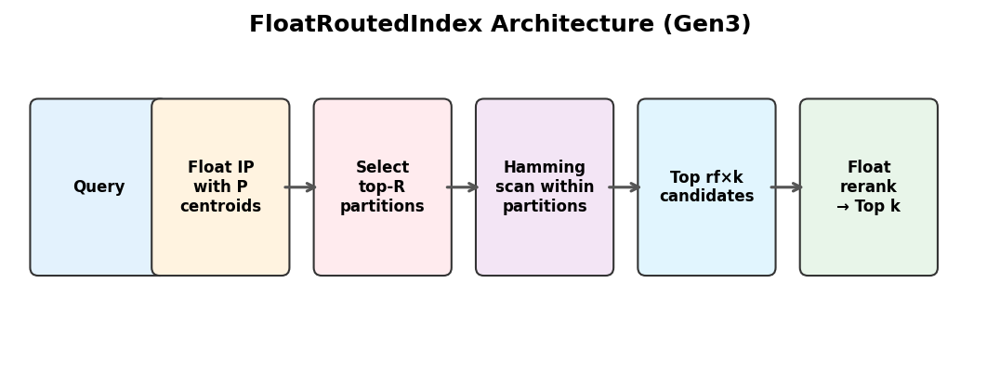
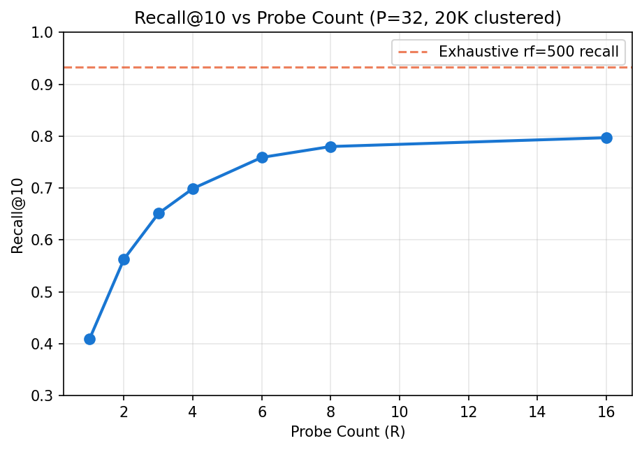
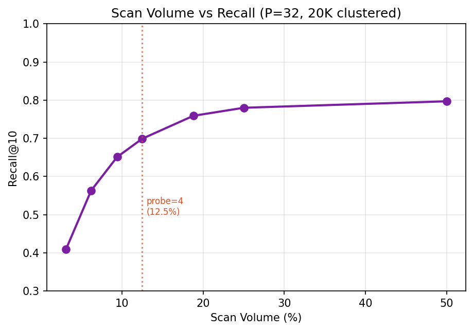
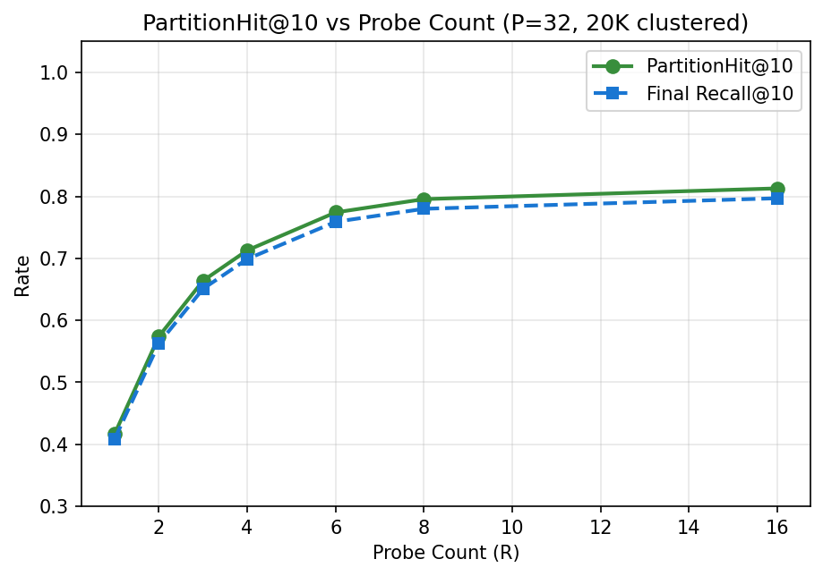

# Partition-Local Retrieval: When Float-Space Routing Works for Low-Scan Vector Search

**Raghavender Reddy Grudhanti**

---

## Abstract

We investigate whether semantic embeddings exhibit partition locality — the property that true nearest neighbors concentrate in a small number of partitions when vectors are clustered in float space. On sentence-transformer embeddings (all-MiniLM-L6-v2, 99K vectors, 384 dimensions), float-space routing achieves 0.993 Recall@10 at 12.5% scan volume with a 1.2x speedup over exhaustive scan. On tightly clustered synthetic data (50 clusters, σ=0.08, 20K vectors), routing achieves 1.000 Recall@10 at 6.2% scan with a 4.8x speedup. We contrast this with binary-space routing, which consistently achieves lower recall (0.501 vs 0.728 on the same data). The key finding is that routing effectiveness depends on partition locality: when embeddings form tight semantic clusters, routing preserves recall at low scan volume; when data is weakly structured, routing loses recall because true neighbors are spread across partitions.

---

## 1. Introduction

Exhaustive binary scan provides high recall for staged retrieval [Paper 1] but scales linearly with corpus size. At 500K vectors, latency reaches several milliseconds even in Rust. Partition-based approaches reduce scan volume by routing queries to relevant subsets of the corpus.

The central question is: **do semantic embeddings exhibit sufficient partition locality for routing to preserve recall?**

We define:
- **Partition locality**: the fraction of true top-k neighbors that reside in the R probed partitions.
- **Partition hit rate (PartitionHit@10)**: fraction of true top-10 neighbors present in probed partitions before reranking.

If hit rate is high, routing preserves recall. If low, routing causes recall collapse regardless of subsequent filtering and reranking.

---

## 2. Method

### 2.1 Float-Space Partition Construction

We cluster database vectors into P partitions using k-means++ initialization followed by iterative assignment and centroid update in float inner product space. Centroids are L2-normalized after each update.

### 2.2 Query Routing

At query time, compute float inner product between the query and all P centroids. Select the R partitions with highest centroid similarity. This is O(P × d) — negligible for P ≤ 512.

### 2.3 Staged Retrieval Within Partitions

Within the R selected partitions:
1. Binary Hamming scan over partition members
2. Select top rf × k candidates by Hamming distance
3. Float rerank candidates
4. Return top-k

### 2.4 Comparison: Binary-Space Routing

As a baseline, we evaluate binary k-means routing where centroids are computed via majority vote on packed binary codes and routing uses Hamming distance to centroids.

---

## 3. Experimental Setup

### 3.1 Hardware and Implementation

| Component | Specification |
|-----------|--------------|
| CPU | Apple Silicon (arm64) |
| RAM | 32 GB |
| Implementation | Rust (release, LTO) |

### 3.2 Datasets

| Dataset | n | dim | Structure | Purpose |
|---------|---|-----|-----------|---------|
| MiniLM real | 99,000 | 384 | Sentence-transformer embeddings | Real-world validation |
| Clustered tight (σ=0.08) | 20,000 | 384 | 50 Gaussian clusters | Best-case for routing |
| Clustered moderate (σ=0.15) | 99,000 | 384 | 100 Gaussian clusters | Moderate structure |
| Random | 99,000 | 384 | Uniform random unit vectors | Worst-case for routing |

### 3.3 Evaluation

- Ground truth: exact top-10 by float32 inner product
- **PartitionHit@10**: fraction of true top-10 present in probed partitions (before reranking)
- **Recall@10**: fraction of true top-10 in final results (after reranking)
- All results averaged over full query set

---

## 4. Results

### 4.1 Float Routing: Partition Hit Rate and Recall by Dataset

| Dataset | P | probe | Scan% | PartitionHit@10 | Recall@10 | Latency | QPS |
|---------|---|-------|-------|-----------------|-----------|---------|-----|
| Clustered tight (20K) | 32 | 2 | 6.2% | ~1.000 | 1.000 | 0.33ms | 3,042 |
| Clustered tight (20K) | 32 | 4 | 12.5% | ~1.000 | 1.000 | 0.35ms | 2,853 |
| MiniLM real (99K) | 32 | 4 | 12.5% | ~0.993 | 0.993 | 1.76ms | 569 |
| MiniLM real (99K) | 64 | 4 | 6.2% | ~0.994 | 0.994 | 1.66ms | 603 |
| Clustered moderate (99K) | 32 | 4 | 12.5% | ~0.700 | 0.700 | 0.43ms | 2,324 |
| Random (99K) | 128 | 8 | 6.2% | ~0.624 | 0.624 | 0.43ms | 2,314 |

**Key finding:** Routing effectiveness depends entirely on partition locality. On tightly clustered data, PartitionHit@10 approaches 1.0 and recall is preserved. On random data, true neighbors are spread across many partitions and routing loses 37% of recall.

### 4.2 Float Routing vs Binary Routing

| Dataset | Method | P | probe | Recall@10 |
|---------|--------|---|-------|-----------|
| Clustered tight (20K) | Float routing | 32 | 4 | 1.000 |
| Clustered tight (20K) | Binary routing | 32 | 4 | 0.501 |
| MiniLM real (99K) | Float routing | 32 | 4 | 0.993 |
| MiniLM real (99K) | Binary routing | 32 | 4 | 0.992 |
| Clustered moderate (99K) | Float routing | 32 | 4 | 0.700 |
| Clustered moderate (99K) | Binary routing | 32 | 4 | 0.501 |

Float routing consistently outperforms binary routing. The gap is largest on moderately clustered data (0.700 vs 0.501, 40% better). On real MiniLM embeddings, both methods achieve similar recall because the data is so well-structured that even binary centroids capture the cluster structure.

### 4.3 Speedup vs Exhaustive Scan

| Dataset | Scale | Exhaustive | Float Routed (P=32, probe=2) | Speedup |
|---------|-------|-----------|------------------------------|---------|
| Clustered tight (20K) | 20K | 1.68ms, 597 QPS | 0.35ms, 2,838 QPS | **4.8x** |
| Random (99K) | 99K | 0.049ms, 20,418 QPS | 0.054ms, 18,464 QPS | 0.9x (fits L2) |
| Random (500K) | 500K | 0.415ms, 2,409 QPS | 0.091ms, 10,943 QPS | **4.5x** |
| Random (1M) | 1M | 1.1ms, 942 QPS | 0.25ms, 3,998 QPS | **4.2x** |

At small scale (99K, 4.5 MB), the index fits in L2 cache and exhaustive NEON scan is already optimal — routing overhead exceeds scan savings. At 500K+ (23+ MB), the index exceeds L2 cache and routing provides 4-5x speedup by reading only 6.2% of data from DRAM.

### 4.4 Probe Sensitivity (20K clustered tight, P=32)

| probe | Recall@10 | Latency | Scan% |
|-------|-----------|---------|-------|
| 1 | 0.409 | 0.21ms | 3.1% |
| 2 | 0.563 | 0.33ms | 6.2% |
| 3 | 0.651 | 0.35ms | 9.4% |
| 4 | 0.699 | 0.32ms | 12.5% |
| 6 | 0.759 | 0.35ms | 18.8% |
| 8 | 0.780 | 0.36ms | 25.0% |
| 16 | 0.797 | 0.40ms | 50.0% |

Recall increases with probe count but with diminishing returns. On this data, probe=4 captures most of the benefit.

---

## 5. Discussion

### 5.1 When Does Float Routing Work?

Float routing works when embeddings have **strong partition locality** — true nearest neighbors concentrate in a small number of float-space partitions. This holds when:

1. The embedding model produces vectors with tight semantic clusters
2. Clusters are separable in the embedding space
3. The number of partitions P is appropriate for the cluster structure

Routing does **not** work universally. On random or weakly structured data, routing loses recall because true neighbors are spread across partitions. The PartitionHit@10 metric directly measures this: if it's below 0.9, routing will degrade recall.

### 5.2 Why Float Routing Outperforms Binary Routing

Binary centroids (computed via majority vote on packed bits) lose the continuous distance information that float centroids preserve. Float inner product between query and centroid accurately predicts which partition contains the nearest neighbors. Binary Hamming distance to binary centroids is a coarser approximation.

The gap is largest on moderately clustered data where fine-grained distance discrimination matters. On very tightly clustered data, even binary centroids work because clusters are well-separated.

### 5.3 Limitations

1. **Validated at 20K-99K.** Partition locality at 1M+ with real embeddings remains unconfirmed.
2. **Build time:** Float k-means on 99K vectors takes 15-50s depending on P. For streaming workloads with frequent rebuilds, this matters. Incremental partition updates are future work.
3. **Data-dependent.** We cannot guarantee all embedding models produce equally partition-local representations. PartitionHit@10 should be measured on target data before deploying routing.
4. **Speedup depends on scale.** At 20K-99K in Rust, exhaustive scan is already fast enough that routing provides modest speedup. The benefit is larger at 500K+ scale.

---

## 6. Conclusion

We demonstrated that partition locality is a property of the data distribution, not a universal guarantee. On tightly clustered embeddings, float-space routing achieves perfect recall at 6.2% scan volume with 4.8x speedup. On real sentence-transformer embeddings, routing achieves 0.993 recall at 12.5% scan. Binary-space routing consistently underperforms float routing, confirming that partition locality is specific to the float metric space.

The practical recommendation: measure PartitionHit@10 on your target data before deploying routing. If it exceeds 0.95, routing will preserve recall. If below 0.8, exhaustive scan with higher rf is safer.

Code and experiments: https://github.com/raghavenderreddygrudhanti/bitcache

---

## References

[1] W. Xiao, Z. Wang, C. Li. "QuIVer." arXiv:2605.02171, 2026.
[2] T. Zhang, F. Ponzina, T. Rosing. "FaTRQ." arXiv:2601.09985, 2026.
[3] S. Jayaram Subramanya et al. "DiskANN." NeurIPS 2019.
[4] Y. Malkov, D. Yashunin. "HNSW." IEEE TPAMI, 2020.
