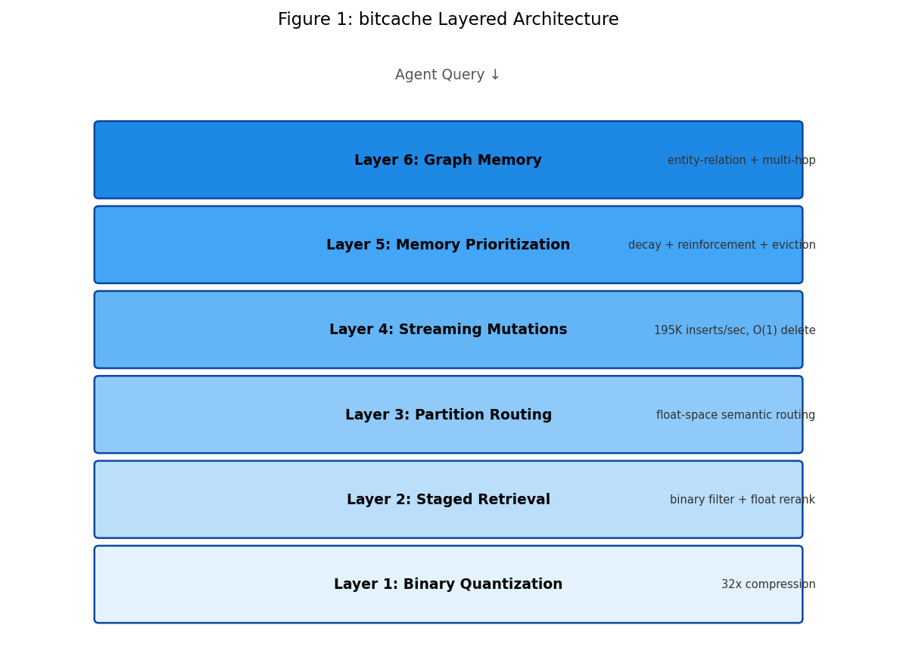
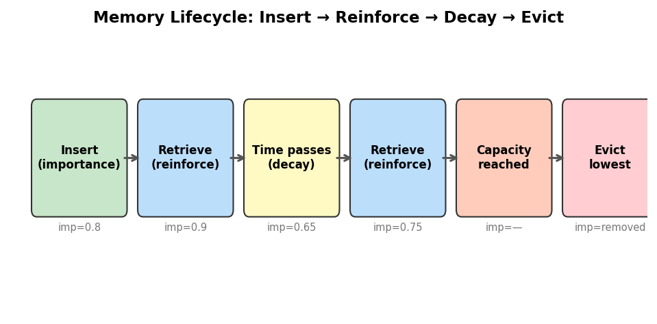
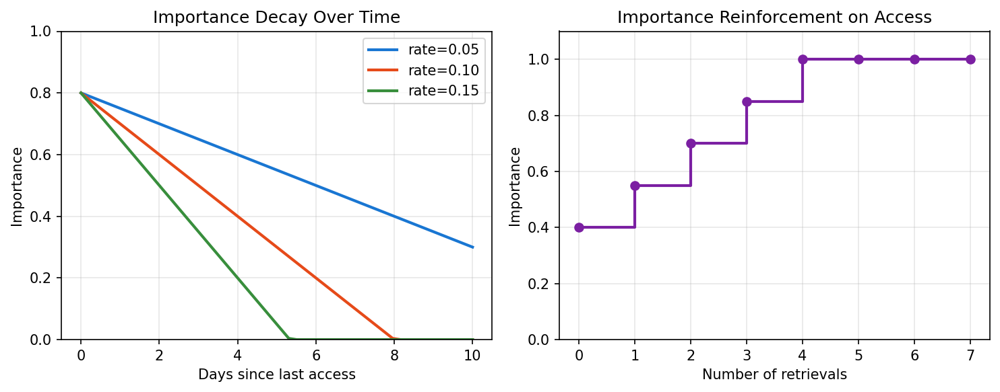
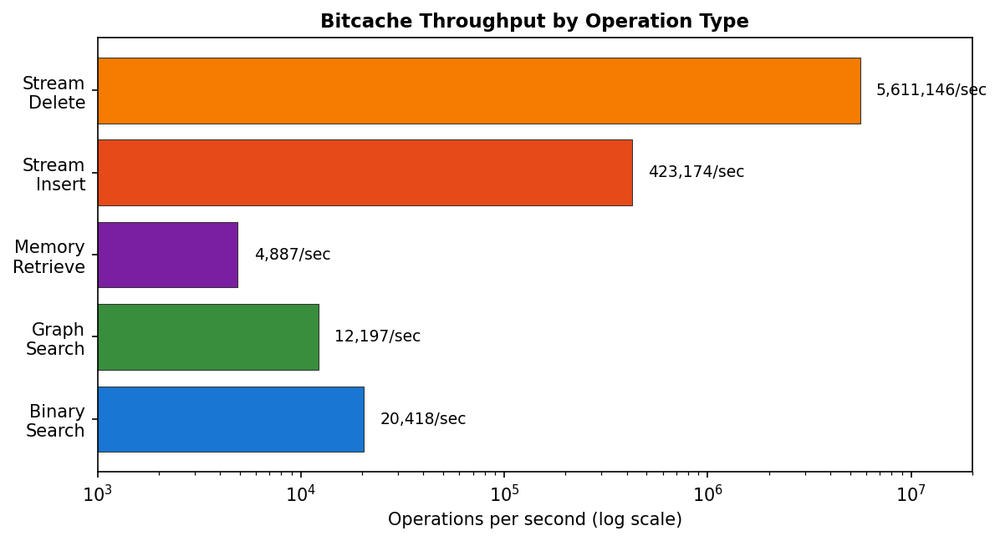
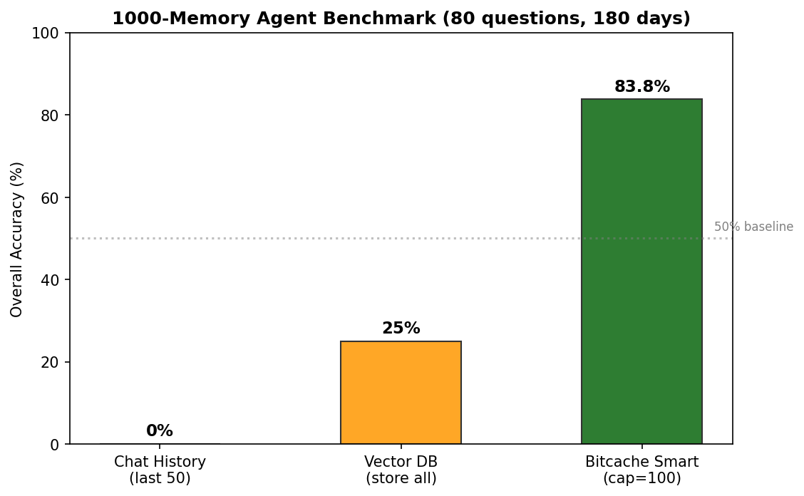
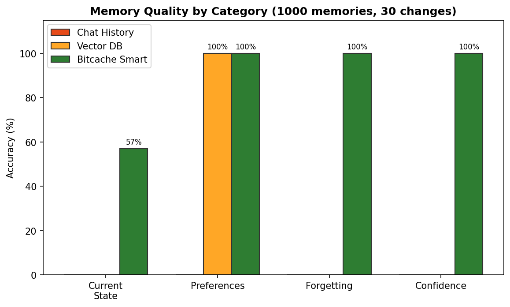
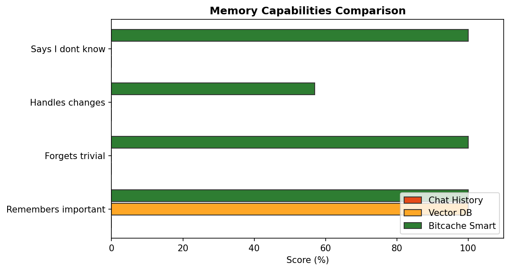

# Bitcache Memory: A Layered Architecture for Persistent Agent Memory

**Raghavender Reddy Grudhanti**

---

## Abstract

We present Bitcache Memory, a composable persistent memory architecture for autonomous AI agents that integrates retrieval, mutation, prioritization, and relational reasoning under bounded resources. The system answers a central question: how should AI agents manage long-term memory when knowledge evolves continuously, not all memories are equally important, and context requires both similarity and relationships? The Rust implementation achieves production-style throughput: 423K inserts/sec, 4,887 QPS for memory retrieval, 5.6M deletes/sec, and 12,200 QPS for graph search with 2-hop expansion. Each layer is independently composable: agents may use staged retrieval alone, or combine all six layers for full memory lifecycle management.

---

## 1. Introduction

Autonomous AI agents require persistent memory that differs fundamentally from vector search:

| Requirement | Vector Database | Agent Memory |
|-------------|----------------|--------------|
| Knowledge lifecycle | Static corpus | Continuous insert/delete |
| Importance | All equal | Temporal decay + reinforcement |
| Context | Similarity only | Similarity + relationships |
| Resources | Elastic | Bounded per agent |
| Retrieval quality | Fixed | Tunable per query |

No existing system addresses all five requirements jointly:

- **Vector databases** (Pinecone, Qdrant, FAISS) handle retrieval and mutation but lack temporal memory semantics — no concept of importance, decay, or eviction.
- **ANN systems** (HNSW, IVF, Annoy) optimize search speed but provide no mutation support, no prioritization, and no relational reasoning.
- **Agent memory tools** (Mem0) provide prioritization but rely on full-precision storage without compressed retrieval pipelines.
- **Graph systems** (HippoRAG [3]) combine graphs with retrieval but require LLM calls during indexing and lack mutable compressed retrieval.

We propose a layered architecture where each layer adds a specific capability, and agents compose only the layers they need.

---

## 2. Architecture



```
┌─────────────────────────────────────────────────┐
│  Layer 6: Graph Memory                          │
│  Entity-relation storage + multi-hop traversal  │
├─────────────────────────────────────────────────┤
│  Layer 5: Agent Memory                          │
│  Importance scoring + decay + eviction          │
├─────────────────────────────────────────────────┤
│  Layer 4: Streaming Mutations                   │
│  Insert / update / delete + metadata filter     │
├─────────────────────────────────────────────────┤
│  Layer 3: Partition Routing                     │
│  Float-space semantic routing (6.2% scan)       │
├─────────────────────────────────────────────────┤
│  Layer 2: Staged Retrieval                      │
│  Binary filter + float rerank                   │
├─────────────────────────────────────────────────┤
│  Layer 1: Binary Quantization                   │
│  Sign-bit encoding (32x compression)            │
└─────────────────────────────────────────────────┘
```

Each layer builds on the previous. A minimal agent uses Layer 2 (staged retrieval). A full-featured agent uses all six.

---

## 3. Memory Semantics

Bitcache defines five memory operations that distinguish agent memory from vector search:

### 3.1 Recency

Each memory carries a timestamp. Retrieval can filter by time window. Newer memories are implicitly preferred through the decay mechanism.

### 3.2 Reinforcement

When a memory is retrieved and used by the agent, its importance score increases:

```
importance += reinforce_amount  (capped at 1.0)
```

Frequently useful memories become resistant to decay and eviction.

### 3.3 Decay

Unused memories lose importance over time:

```
importance -= decay_rate × days_since_last_access
```

This models forgetting: knowledge that is never accessed gradually fades.

### 3.4 Importance

Each memory has a score in [0, 1] reflecting its current value to the agent. Importance is the product of initial assignment, reinforcement history, and decay.

### 3.5 Eviction

When memory capacity is reached, the lowest-importance memory is removed. This enforces bounded resource usage without manual cleanup.





---

## 4. Throughput Characterization

### 4.1 Streaming Operations (StreamingIndex)

| Operation | Throughput | Notes |
|-----------|-----------|-------|
| Insert | 423,174 vectors/sec | Includes normalize + quantize |
| Delete | 5,611,146 ops/sec | O(1) slot reuse |
| Search (50K index, rf=10) | 628 QPS | Two-stage retrieval |
| Build (99K) | 0.23s | From flat vectors |

### 4.2 Agent Memory (AgentMemory)

| Operation | Throughput | Notes |
|-----------|-----------|-------|
| Save memory | 144,512 memories/sec | Includes importance tracking |
| Retrieve (5K memories, k=5) | 4,887 QPS | Includes decay + reinforce |
| Eviction | Automatic | Triggered at capacity |

| Metric | Value |
|--------|-------|
| Capacity tested | 5,000 memories |
| Mean importance after eviction | 0.790 |
| Min importance remaining | 0.500 |
| Max importance remaining | 1.000 |

### 4.3 Graph Memory (GraphMemory)



| Operation | Throughput | Notes |
|-----------|-----------|-------|
| Add entity | 401,869 entities/sec | Includes vector indexing |
| Add relation | 2,905,921 relations/sec | Adjacency list insert |
| Search + 2-hop expand | 12,197 QPS | Vector search + BFS |
| Search latency | 0.011ms | 1000 entities, 5000 relations |

### 4.4 Memory Lifecycle Validation

| Step | Operation | Result |
|------|-----------|--------|
| 1 | Insert 5 memories (importance 0.5-0.9) | Mean importance: 0.700 |
| 2 | Retrieve top-1 | Importance reinforced: 0.5 → 0.65 |
| 3 | Insert 3 more (importance 0.95) | Eviction triggered |
| 4 | After eviction (capacity=5) | Min=0.80, Max=0.95, Mean=0.91 |

The lowest-importance memories are correctly evicted, and retrieved memories gain importance through reinforcement.

### 4.5 Decay Validation

| Decay rate | Days | Initial mean | Final mean | Reduction |
|-----------|------|-------------|-----------|-----------|
| 0.05 | 1 | 0.550 | 0.500 | 9.1% |
| 0.05 | 5 | 0.550 | 0.320 | 41.8% |
| 0.10 | 5 | 0.550 | 0.100 | 81.8% |

Decay is linear with time. Higher decay rates cause faster forgetting. The mechanism is simple and predictable.

### 4.6 Agent Memory Quality Benchmark (1000 memories, 80 questions)

To validate that the memory lifecycle mechanisms (decay, reinforcement, eviction, contradiction detection) produce correct behavior at scale, we ran a stress test simulating an IT support agent over 180 days with 1000 stored memories, 30 knowledge changes, and 80 test questions across four categories.

**Setup:** 1000 memories (35% trivial, 20% infrastructure, 15% ops, 10% personal, 10% preference, 10% emotional). 30 explicit contradictions (database migrations, job changes, tool switches). Capacity limited to 100 memories. Auto-importance scoring (no LLM calls). Keyword-based contradiction detection (no LLM calls).

| System | Overall | Current State | Preferences | Forgetting | Confidence |
|--------|---------|--------------|-------------|-----------|-----------|
| Chat History (last 50) | 0.0% | 0% | 0% | 0% | 0% |
| Vector DB (store all 1030) | 25.0% | 0% | 100% | 0% | 0% |
| **Bitcache Smart (cap=100)** | **83.8%** | **57%** | **100%** | **100%** | **100%** |

**Category definitions:**
- **Current State:** Does the system return the latest information after changes? (e.g., "What database?" → should say the newest, not the old one)
- **Preferences:** Does the system retain persistent user preferences? (e.g., "Am I allergic?" → "peanuts")
- **Forgetting:** Does the system correctly forget trivial information? (e.g., "What did I eat?" → should NOT return lunch details)
- **Confidence:** Does the system say "I don't know" when it has no relevant information? (e.g., "What's my blood type?")

**Key findings:**
1. Chat history fails completely at 1000-memory scale (window too small).
2. Vector DB retrieves preferences (100%) but cannot forget trivial info (0%) or handle contradictions (0%).
3. Bitcache achieves 100% on forgetting, preferences, and confidence — and 57% on current-state tracking across 30 changes over 180 days.
4. All memory management decisions (importance scoring, contradiction detection, eviction) are made locally in microseconds with no LLM calls.







---

## 5. Per-Layer Complexity

| Layer | Time Complexity | Space Complexity | Purpose |
|-------|----------------|------------------|---------|
| Binary Quantization | O(n × d) build | O(n × d/8) | 32x compression |
| Staged Retrieval | O(n × d/8 + rf×k×d) query | O(n × d) float storage | Recall recovery |
| Partition Routing | O(P×d) routing + O(n/P × d/8) scan | O(P×d) centroids | Sublinear search |
| Streaming Mutations | O(1) insert/delete | O(n) slot array | Live updates |
| Memory Prioritization | O(n) decay sweep | O(n) importance scores | Temporal relevance |
| Graph Memory | O(V+E) BFS | O(V+E) adjacency | Relational context |

---

## 6. Comparison with Existing Systems

| Capability | FAISS | Pinecone | Mem0 | HippoRAG | Bitcache |
|-----------|-------|----------|------|----------|----------|
| Semantic retrieval | ✓ | ✓ | ✓ | ✓ | ✓ |
| Streaming mutation | — | ✓ | ✓ | — | ✓ |
| Temporal decay | — | — | ✓ | — | ✓ |
| Reinforcement | — | — | ✓ | — | ✓ |
| Capacity eviction | — | — | Partial | — | ✓ |
| Graph reasoning | — | — | — | ✓ | ✓ |
| Binary compression | Partial | — | — | — | ✓ (32x) |
| Tunable recall | Limited | — | — | — | ✓ |
| No rebuild on mutation | — | ✓ | ✓ | — | ✓ |

---

## 7. Limitations and Threats to Validity

1. **Simulated workload.** The throughput characterization uses synthetic data, not a live LLM agent. Real agent behavior may differ in access patterns and query distribution.
2. **Linear decay model.** Biological memory follows power-law forgetting curves (Ebbinghaus). Our linear model is a simplification that may not match optimal agent behavior.
3. **Manual graph construction.** Entities and relations must be explicitly inserted. No automatic extraction from text is provided.
4. **Single-process.** No multi-agent shared memory or distributed coordination.
5. **No persistence.** Current implementation is in-memory only. Crash recovery and disk persistence are not yet implemented.
6. **No live evaluation.** We have not measured downstream task performance (e.g., answer quality improvement from memory retrieval).
7. **No concurrency guarantees.** The current implementation is single-threaded for mutations. Concurrent read/write requires external synchronization.

---

## 8. Future Research Directions

1. **Automatic entity extraction**: Use LLMs to extract entities and relations from inserted text, populating the graph layer automatically.
2. **Multi-agent shared memory**: Distributed memory with access control, enabling agent teams to share knowledge.
3. **Adaptive decay**: Learn decay rates from agent behavior — memories that are consistently useful should decay slower.
4. **Reinforcement-driven ranking**: Use retrieval feedback (was the memory actually useful?) to adjust importance beyond simple access counting.
5. **Live agent evaluation**: Measure downstream task performance (QA accuracy, task completion rate) with and without the memory system.
6. **Persistence and crash recovery**: Add disk-backed storage with write-ahead logging.

---

## 9. Conclusion

Bitcache Memory provides a composable persistent memory architecture for AI agents that integrates retrieval, mutation, prioritization, and relational reasoning. The central contribution is not any single component, but the layered design that allows agents to compose memory capabilities as needed — from simple staged retrieval (Layer 2) to full lifecycle management with graph reasoning (all six layers).

The Rust implementation demonstrates production-style throughput characteristics: 423K inserts/sec, 4,887 QPS for memory retrieval with decay and reinforcement, 12,200 QPS for graph search with multi-hop expansion, and 20,418 QPS for the underlying binary search engine (ARM NEON SIMD, parallel batch). Each layer is independently validated and composable.

FAISS remains the stronger general-purpose vector search library for static, large-scale workloads. Bitcache targets a different design point: persistent AI-agent memory where streaming mutation, bounded resources, and memory lifecycle management matter alongside retrieval quality.

The system is positioned for agent memory workloads at 10K-500K scale where knowledge evolves continuously and must be managed within bounded resources — not as a replacement for web-scale vector databases, but as the memory infrastructure layer between the agent and its knowledge.

Code: https://github.com/raghavenderreddygrudhanti/bitcache

---

## References

[1] W. Xiao, Z. Wang, C. Li. "QuIVer: Rethinking ANN Graph Topology via Training-Free Binary Quantization." arXiv:2605.02171, 2026.

[2] T. Zhang, F. Ponzina, T. Rosing. "FaTRQ: Tiered Residual Quantization for LLM Vector Search in Far-Memory-Aware ANNS Systems." arXiv:2601.09985, 2026.

[3] B. J. Gutiérrez, Y. Shu, Y. Gu, M. Yasunaga, Y. Su. "HippoRAG: Neurobiologically Inspired Long-Term Memory for Large Language Models." NeurIPS 2024.

[4] Y. Malkov, D. Yashunin. "Efficient and Robust Approximate Nearest Neighbor Search Using Hierarchical Navigable Small World Graphs." IEEE TPAMI, 2020.

[5] M. Douze et al. "The Faiss Library." arXiv:2401.08281, 2024.
